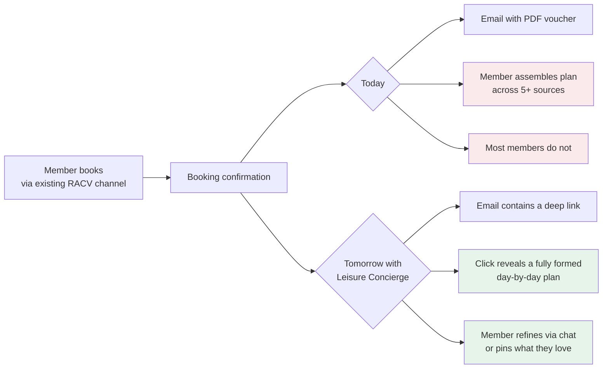
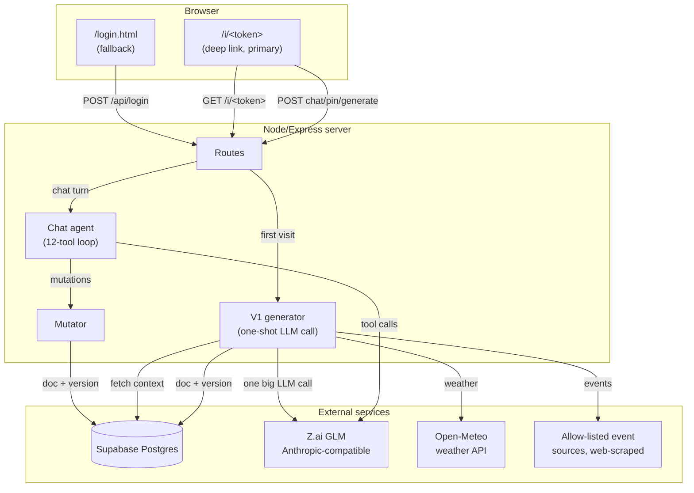
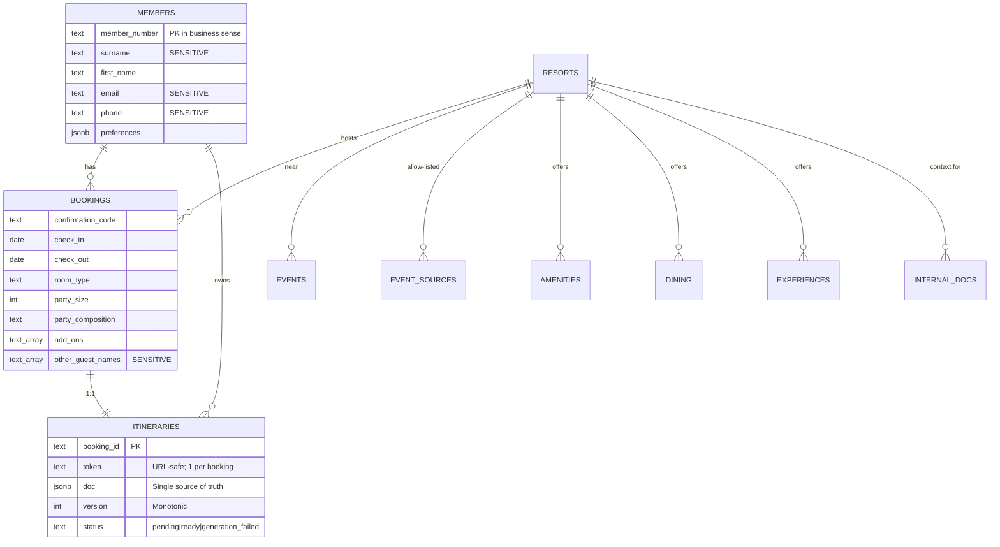
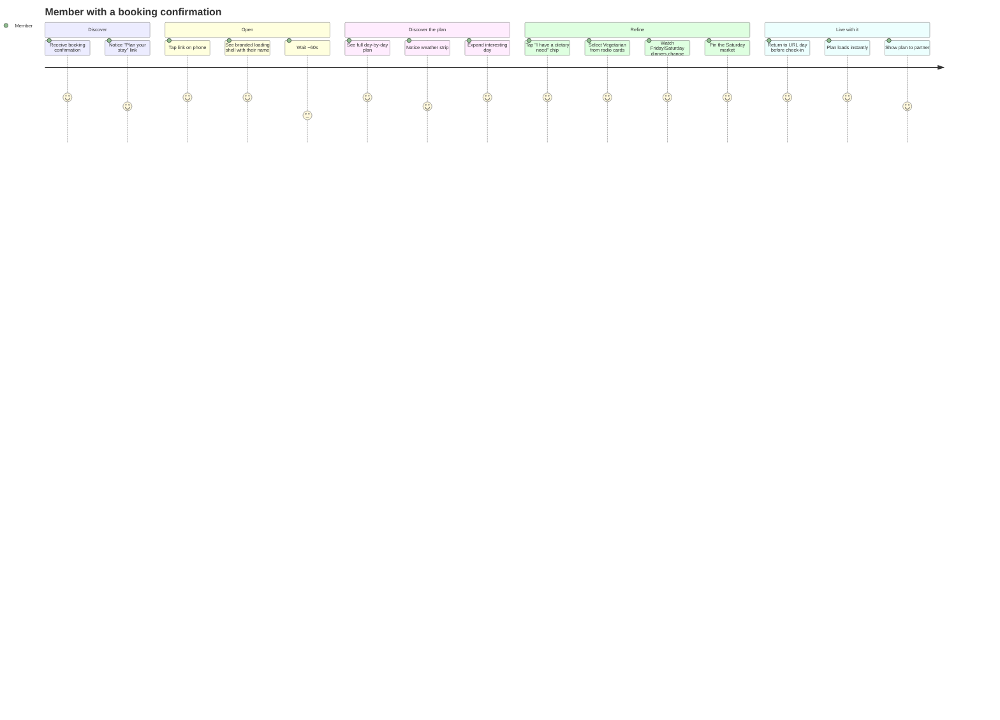
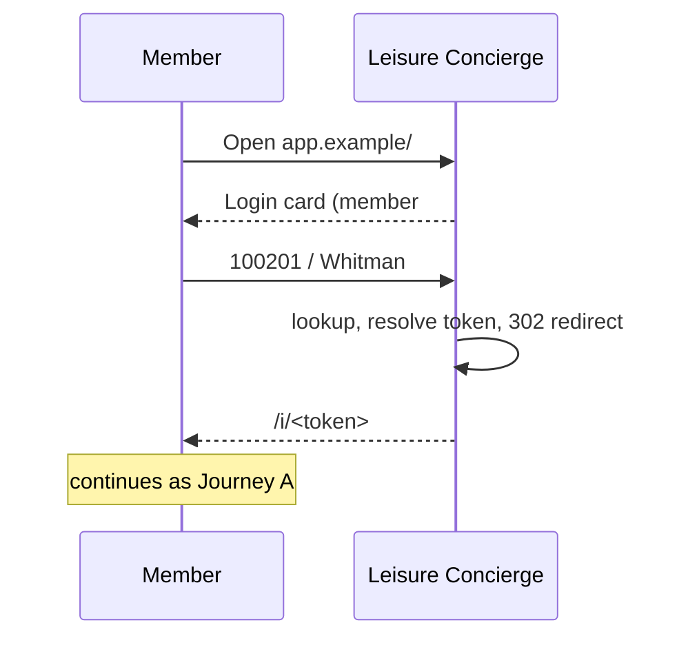
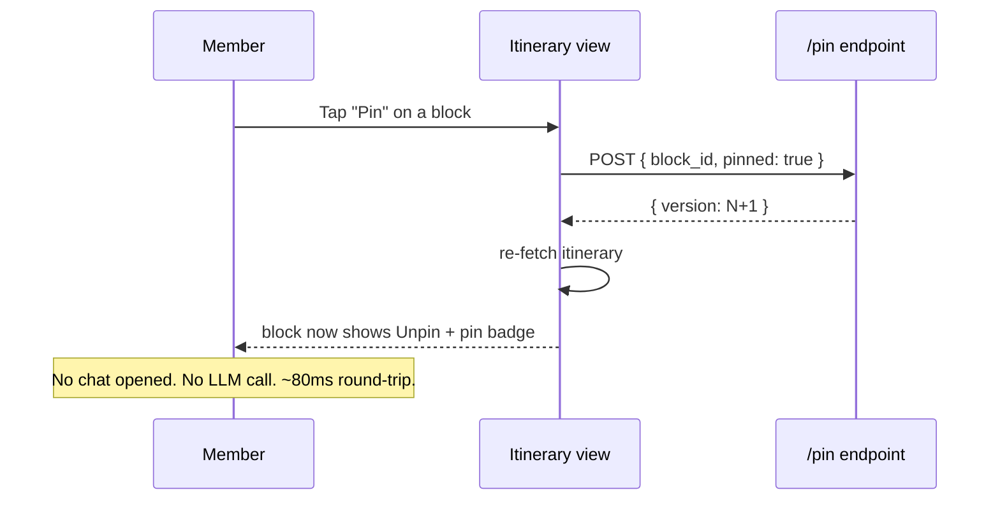
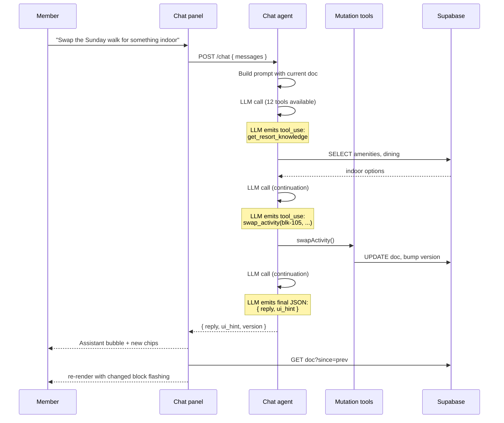
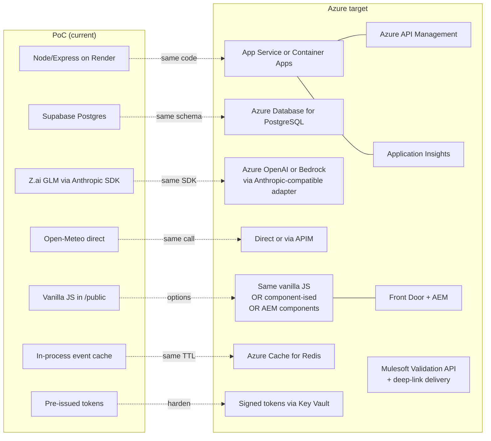

# Leisure Concierge — Proof of Concept Overview

> **Audience.** Product, design, engineering, and leadership stakeholders evaluating the leisure-itinerary capability. This document is the alignment artifact for what the production system (Azure, potentially fronted by AEM) should build towards. The PoC behind it is intentionally not the final product. It is a working illustration of capability, brand, and interaction so that we can agree on scope and shape before the real build.
>
> **Status.** Live at https://github.com/samhud1999/leisure-concierge. ~30 commits across two phases (chat-only V1, itinerary-first V2). 67/67 unit tests green. Deployable to Render.com for stakeholder demos via a one-file Blueprint.
>
> **Read time.** ~20 minutes.

---

## 0. Access the running PoC

> The host URL is **`{BASE}`**. While the PoC is running locally on the author's machine, `{BASE}` is `http://localhost:3000`. Once deployed to Render (one-click via the committed `render.yaml`), `{BASE}` becomes the public Render URL (e.g. `https://leisure-concierge.onrender.com`). Replace `{BASE}` below with whichever is current.

### Two ways in

| Path | Example | Notes |
|---|---|---|
| **Primary — deep link** | `{BASE}/i/9tfp8IwjDBsw` | One URL per booking. No login screen. Mirrors the production flow where the link arrives in the booking confirmation email. |
| **Fallback — validation form** | `{BASE}/` | Member number + surname. Resolves to the same `/i/<token>` URL. The validation here is **soft**, suitable for the demo only. Production will use the Mulesoft Validation API and/or deep-link-as-validation (see §11 + §12). |

### Live demo links

11 booking demos across 7 RACV resorts. Two are pre-built (`ready` — open and they render instantly). Nine are `pending` (first visit triggers a fresh ~60-90 s `glm-4.7` build; cached forever after that).

| Guest | Member # | Surname (for fallback) | Resort | Stay | Status | Deep link |
|---|---|---|---|---|---|---|
| Eleanor Whitman | `100201` | Whitman | RACV Torquay Resort | 25–28 Jun | ✅ ready | `{BASE}/i/9tfp8IwjDBsw` |
| Andre Kaplan | `100301` | Kaplan | RACV Cape Schanck Resort | 7–9 Jul | ✅ ready | `{BASE}/i/Aq2m5B3oaLld` |
| Rohan Patel | `100204` | Patel | RACV Torquay Resort | 2–5 Jul | ⏳ pending | `{BASE}/i/lE6pAh86WOfS` |
| Freya Andersson | `100214` | Andersson | RACV Hobart | 22–25 Jun | ⏳ pending | `{BASE}/i/si7cDnZNN3Uo` |
| Freya Andersson | `100214` | Andersson | RACV Cape Schanck Resort | 26–29 Jun | ⏳ pending | `{BASE}/i/ZnlyXMwq4TG6` |
| Natasha Sokolov | `100302` | Sokolov | RACV Healesville Country Club | 10–13 Jul | ⏳ pending | `{BASE}/i/4fxVoKhjeSH_` |
| Craig Patel | `100303` | Patel | RACV Inverloch Resort | 18–22 Jul | ⏳ pending | `{BASE}/i/Lt0ZjH6hHDsb` |
| Gavin Mitchell | `100304` | Mitchell | RACV Noosa Resort | 25–30 Jul | ⏳ pending | `{BASE}/i/_XJay1D9u9mc` |
| Chris Park | `100305` | Park | RACV Royal Pines Resort | 3–5 Aug | ⏳ pending | `{BASE}/i/v-PoqaQCPPMB` |
| Jenny Liu | `100306` | Liu | RACV Goldfields Resort | 7–10 Aug | ⏳ pending | `{BASE}/i/aFZS62Dt-PzH` |
| Bethany Stone | `100307` | Stone | RACV Torquay Resort | 15–18 Aug | ⏳ pending | `{BASE}/i/IEUeJbh1P2ov` |

### Recommended demo path

1. **Open `{BASE}/i/9tfp8IwjDBsw`** (Eleanor Whitman, RACV Torquay, pre-built). The artifact renders in under a second. Walk a stakeholder through: branded hero, weather strip, day-by-day timeline, kind-coloured blocks.
2. **Refine via chat**: tap a suggestion chip ("Add a dinner reservation") or type "I'm vegetarian, please update". Watch a block change and briefly flash yellow.
3. **Pin something**: tap the Pin button on any block to demonstrate the immovable flag.
4. **On a phone**, open the same URL. Show the floating yellow chat button (FAB) and the bottom-sheet behaviour.
5. **Show the fallback path**: open `{BASE}/` and enter `100201` / `Whitman`. Land on the same itinerary.
6. **Open a pending link** (e.g. Bethany Stone) to show the branded loading shell while a fresh build runs. Be honest about the 60-90 s wait — the production version pre-builds at booking-confirmation time so this wait disappears for real members.

> Each token in the table is single-purpose and tied to one booking. Anyone with the URL can read and mutate that single demo itinerary. This is acceptable for an internal alignment demo. It is **not** the production validation model — see §11 for the Mulesoft + deep-link-delivery approach.

---

## 1. Why we are doing this

RACV members planning leisure trips today face the same fragmented experience as everyone else:

- Booking sits in one system (a confirmation email).
- The resort's own offerings — dining, amenities, experiences — live on disparate web pages.
- The local area's events, markets, and attractions live across dozens of third-party sites.
- The weather, which actually drives what activities make sense on which days, lives in a separate app.
- The traveller is left to manually stitch these together. Some do it well; most do not bother.

The opportunity is to deliver, **at the point of booking confirmation**, a personalised day-by-day plan that already does this synthesis. The plan should reflect the member's actual booking (resort, dates, party, room), be sensitive to the weather forecast, surface real local events that overlap the stay, and remain editable by the member up to and during the stay itself.

This PoC demonstrates that the capability is real, the experience is achievable with current AI tooling at acceptable latency and cost, and the data-handling shape (no PII flowing into the LLM context, single-doc-per-booking with version control) is sane.

> ⚠️ **The PoC is not a secure solution.** Member validation is a thin member-number + surname check against the seed data, and the deep-link tokens have no expiry, no signing, no revocation. The production system will need a proper uplift here — see §11 for what the Azure version brings in.



---

## 2. The north star

What the production experience should feel like for the member, once we have built towards it on Azure:

| Moment | Experience |
|---|---|
| **Booking confirmation email arrives** | A "Plan your stay" call-to-action sits alongside the booking confirmation. One link. |
| **Member taps the link on their phone** | The page loads with a personalised greeting, their resort, dates, party makeup, weather strip, and a complete day-by-day plan already rendered. No login, no questions, no waiting. |
| **Member scans the plan** | Each day is a clear card with the date written out, weather summary, and 2-4 activity cards. Activities are kind-coloured (arrival, dining, activity, spa, event) with a vertical timeline. |
| **Member wants a different dinner Friday** | A chat panel sits alongside the itinerary. The member taps "Swap Friday dinner" (a suggestion chip) or types it. A few seconds later the Friday dinner block has been replaced. The new block briefly highlights yellow so the change is visible. |
| **Member visits the URL a week later from a different device** | The URL still works, with the same itinerary. Their pins and refinements have been kept. |
| **Member checks in at the resort** | The plan lives on as a daily reference. Front-desk staff can see and (in a future version) collaborate on it. |

The north star is **structured itinerary as the primary artifact, chat as the augmenter**, not the other way around. The PoC has been designed end-to-end around this principle.

---

## 3. What the PoC demonstrates

The PoC is a complete, working leisure concierge for **RACV** members. It is small (~3,500 lines of code), fast (built in days), and runs on a free tier. It deliberately mirrors the shape of the Azure production version so that the design conversations transfer cleanly.



### What is in the PoC, by capability

| Capability | In PoC? | Notes |
|---|---|---|
| Deep-link entry per booking | ✅ | URL-safe tokens pre-issued at migration time |
| Member-number + surname login fallback | ✅ | Returns same token; same destination |
| One-shot itinerary generation | ✅ | One LLM call, full context, ~37-90s on `glm-4.7` |
| Persistent itinerary state | ✅ | JSONB doc per booking in Supabase; survives refresh / new device |
| Day-by-day timeline with clear dates | ✅ | "Friday, 27 June" written out; numbered day circle |
| Weather strip across days | ✅ | Open-Meteo, no API key, ~16-day horizon |
| Activity cards with kind colours | ✅ | 7 kinds: arrival / dining / activity / spa / event / departure / free |
| Local events in stay window | ✅ | 30 seeded events + live web scrape from 3 Surf-Coast sources |
| Chat refinement | ✅ | 12-tool agent loop, structured `ui_hint` for adaptive UI |
| Adaptive chat patterns | ✅ | 5 patterns: chips, radio cards, multi-select, structured form, free text |
| Inline Pin / Swap / Remove | ✅ | Direct API for Pin; chat-pre-formatted for Swap and Remove |
| Mobile chat as bottom sheet | ✅ | FAB + slide-up + backdrop, ≤768px |
| RACV brand fidelity | ✅ | Real italic logo, royal blue, yellow pill CTAs, journey curve |
| Variety enforcement | ✅ | Prompt rules: no named restaurant or venue twice per stay |
| Style enforcement | ✅ | Prompt rules: no em dashes, no AI-speak filler |
| Sensitive PII never leaks | ✅ | Column whitelists; nothing surname/email/phone reaches the artifact |
| Pre-issued shareable URLs | ✅ | One token per existing booking; URL-safe |
| Mutations bound to validated session | ✅ | Every mutation is scoped to the URL token. Not cryptographically validated in the PoC — that lift comes in Azure. |
| Multi-member, multi-booking demo | ✅ | 23 seeded bookings across 16 members, 10 demo members ready to share |
| Live event-source freshness cache | ✅ | 12-hour in-process TTL |
| **Out of scope for PoC** | | |
| Booking-system integration | ❌ | Bookings are seeded; real RACV booking system is the production source of truth |
| Real RACV member SSO | ❌ | Login is light: member# + surname |
| Email/SMS delivery of the URL | ❌ | Tokens are pre-issued; delivery channel is a production concern |
| Per-member preference history | ❌ | Preferences are session-scoped to the current itinerary |
| Multi-region deployment | ❌ | Single dyno; one Z.ai endpoint |
| Real production observability | ❌ | `console.warn`s and Render log tail |
| Rate limiting | ❌ | None |

---

## 4. Architecture in one diagram

```mermaid
sequenceDiagram
  autonumber
  participant M as Member<br/>(browser)
  participant L as Leisure Concierge<br/>server
  participant DB as Supabase
  participant LLM as Z.ai GLM
  participant OM as Open-Meteo
  participant EV as Event sources

  Note over M,DB: First visit to a brand-new deep link
  M->>L: GET /i/<token>
  L->>DB: SELECT itinerary by token
  DB-->>L: { status: 'pending', booking_id, member_id }
  L->>DB: SELECT booking + member + resort
  DB-->>L: metadata for preview
  L-->>M: HTML shell + inlined { status: 'pending', preview }
  Note over M: Loading shell renders<br/>personalised hero
  M->>L: POST /generate
  L->>DB: SELECT resort knowledge, events, member
  L->>EV: live event scrape (cached 12h)
  EV-->>L: events
  L->>OM: forecast for stay window
  OM-->>L: daily weather
  L->>LLM: one call with full context
  LLM-->>L: structured itinerary JSON
  L->>DB: UPDATE doc, status='ready', version=1
  L-->>M: { itinerary }
  Note over M: Itinerary renders;<br/>chat panel reveals

  Note over M,DB: Subsequent visit
  M->>L: GET /i/<token>
  L->>DB: SELECT itinerary
  DB-->>L: ready doc
  L-->>M: HTML shell + inlined full doc
  Note over M: Instant render

  Note over M,DB: Chat refinement
  M->>L: POST /chat { messages }
  L->>DB: load current doc
  L->>LLM: agent loop (12 tools)
  loop until stop_reason != tool_use
    LLM-->>L: tool_use(swap_activity, ...)
    L->>L: mutator applies change
    L->>DB: UPDATE doc + version
    L->>LLM: tool_result
  end
  LLM-->>L: final { reply, ui_hint }
  L-->>M: { reply, ui_hint, version }
  M->>L: GET /api/itinerary/<token>?since=prev
  L->>DB: SELECT doc
  DB-->>L: new doc
  L-->>M: { itinerary }
  Note over M: Re-renders; changed<br/>blocks flash yellow
```

---

## 5. The data shape (what gets stored, what gets sent)

The whole product hinges on a single JSON document — one per booking, stored in Supabase as `itineraries.doc`. Mutations are always whole-doc-atomic with a monotonic version counter. Reads are always "give me the whole thing".



### Why a JSON doc, not normalised tables

| Decision | Rationale |
|---|---|
| **One JSONB per booking, not joined tables** | Reads are always "give me everything for this stay"; mutations are atomic on the whole doc; schema evolution doesn't need migrations. The price (a small loss of relational query power) is acceptable for a doc that maxes out at ~5KB. |
| **Member PII never enters the doc** | Only `first_name` and `member_number` (the latter already a public-ish identifier) are copied in. Surname, email, phone, ID number stay in the `members` table behind a SELECT whitelist. |
| **Stable IDs (`day-N`, `blk-NNN`)** | Mutations reference specific blocks. Without stable IDs, every refinement would risk hitting the wrong block. |
| **`pinned` flag on every block** | Members can lock in items they love; regeneration preserves their position; swap/remove rejects them. Without this, "regenerate Friday because the dinner is wrong" would erase the things the member wanted to keep. |

---

## 6. User journeys

### Journey A — The primary experience (deep link)



### Journey B — Login fallback (lost the link)



### Journey C — Inline refinement (no chat opens)



### Journey D — Chat refinement (with tool calls)



### Journey E — Mobile (≤768px viewport)

The chat is hidden behind a yellow floating action button (FAB) at bottom-right. Tapping the FAB slides the chat up as a bottom sheet covering most of the viewport. A backdrop dims the itinerary; tap the backdrop, the X button, or Escape to close. Inline Pin/Swap/Remove buttons also auto-open the sheet so the member can see the agent's reply. The mobile pattern mirrors the existing RACV Assistant widget seen on racv.com.au.

---

## 7. User stories

Grouped by persona. Each story has a one-line acceptance criterion drawn from the PoC's behaviour today.

### Primary — RACV resort member

| ID | Story | Acceptance |
|---|---|---|
| US-1.1 | As a member, I want a single URL that opens my personalised stay plan, so I do not have to interview a chatbot to get started. | `/i/<token>` renders without asking questions. |
| US-1.2 | As a member, I want the plan to know my booking exactly, so it fits my real stay. | Hero card shows live resort + dates + room type from the bookings row. |
| US-1.3 | As a member, I want each day clearly labelled with day-of-week and date, so I do not have to count from check-in. | Every day card shows "Friday, 27 June" plus a numbered day circle. |
| US-1.4 | As a member, I want the plan to respect the weather, so outdoor activities land on fair days. | Days with rain probability above 60% get indoor activities only. |
| US-1.5 | As a member, I want to refine the plan without restarting, so a closer fit doesn't feel like a re-interview. | Chat tools mutate specific blocks; existing plan persists; pinned items survive. |
| US-1.6 | As a member, I want to pin items I love so they survive regeneration. | Pinned blocks resist swap, remove, and regenerate-day, and stay at their original index. |
| US-1.7 | As a member, I want variety across my stay, so I don't visit the same restaurant twice. | Prompt rules forbid a named venue from appearing more than once per stay. |
| US-1.8 | As a member, I want the chat to suggest sensible next steps, so I don't have to compose every message. | Every agent reply carries a `ui_hint`; frontend renders chips/radio/multi/form. |
| US-1.9 | As a member on my phone, I don't want the chat competing with the itinerary for space. | Mobile shows the chat as a slide-up sheet behind a FAB. |
| US-1.10 | As a member, I do not want a typo at the validation step to reveal which field was wrong. | 401 body is generic; no surname/member text. |

### Secondary — RACV ops / demo presenter

| ID | Story | Acceptance |
|---|---|---|
| US-2.1 | As ops, I want each booking to have a shareable URL that needs no login, so a stakeholder demo is one click. | Tokens pre-issued at migration time; URL-safe; no expiry in PoC. |
| US-2.2 | As ops, I want to know how long the first visit takes, so I can set expectations. | Loading shell says "60-90 seconds, once per token"; pre-warm script exists. |
| US-2.3 | As ops, I want member PII never to appear in URLs or page source. | Surname/email/phone/ID never selected; itinerary doc carries first name + member number only. |
| US-2.4 | As ops, I want the page to be a polished branded experience, not a chat transcript. | Hero, weather strip, day cards, branded buttons, real RACV logo. |

### Tertiary — Engineer picking up the work

| ID | Story | Acceptance |
|---|---|---|
| US-3.1 | As an engineer, I want one README to tell me how to run this locally. | `README.md` lists SQL files, env vars, and `npm install && npm start`. |
| US-3.2 | As an engineer, I want to know which file owns which concern. | `ARCHITECTURE.md` maps every file to its responsibility. |
| US-3.3 | As an engineer, I want to know what is tested vs not. | `ARCHITECTURE.md` §8 lists all 67 tests by suite + names the explicit gaps. |
| US-3.4 | As an engineer, I want the production version to share architecture with the PoC. | This document, §10. |

---

## 8. What worked architecturally

These are the choices the PoC validated. They should transfer to the Azure build.

| Choice | Why it worked |
|---|---|
| **Itinerary as a structured JSON, mutated by tools** | The agent never regenerates the whole plan; it only changes what was asked. This kept latency low, kept the prompt budget small, and removed the "every chat reply rewrites everything" failure mode. |
| **One-shot V1 build, lazy on first visit** | Pre-generating all itineraries at booking-confirmation time would burn LLM cost on members who never click. Lazy build trades a one-time ~60s wait for near-zero idle cost. |
| **Token deep links over chat-first** | A shareable URL aligns with how booking confirmations already work. Members find the artifact more useful than a transcript. |
| **HTML `<details>` for day accordions** | Native HTML disclosure, no toggle JS, works without JavaScript at all, prints cleanly. |
| **Adaptive cards in the chat panel** | The five `ui_hint` patterns (chips, radio, multi, form, none) turn the chat into a guided flow rather than free-text. Substantially reduces "blank cursor" friction. |
| **Vanilla JS for the PoC** | Zero build time, no framework decisions, the entire frontend is readable in one sitting. The cost (no component reuse, no state management library) was acceptable at this scale. |
| **Read-only tool factory, request-scoped Supabase client** | The chat agent's read-only handlers are constructed per request with the request's Supabase client. This is the right shape for any multi-tenant production environment with RLS. |
| **Anthropic-SDK-compatible LLM endpoint** | Z.ai's `/api/anthropic` endpoint let us reuse the `@anthropic-ai/sdk` package and tool-use protocol unchanged. The same code targets Claude on Anthropic, Bedrock, or Azure OpenAI with an adapter. |
| **Column whitelists at every read site** | `MEMBER_SAFE` and `BOOKING_SAFE` constants are referenced in every SELECT. Adding a new sensitive column to the schema would require an explicit decision to add it to the whitelist. |
| **Tokens stored as standard base64, URL-safe-normalised at the boundary** | DB stores `gen_random_bytes(9)` base64; routes convert at request boundaries via helper functions. Simpler than a one-time data migration after we discovered the URL-safety issue. |

## 9. What did not work, and what we'd change

Honesty matters here. The PoC made some choices that should not survive the Azure build.

| What didn't work | Why | Azure build should... |
|---|---|---|
| **In-process 12-hour cache for live events** | Singleton in Node memory; evaporates on dyno restart; doesn't scale to multi-instance. | Use Azure Cache for Redis. Same TTL, same code shape, swap the impl. |
| **No rate limiting anywhere** | The PoC trusted its low-traffic demo footprint. Any public deploy would burn LLM cost on a bot. | Per-token and per-IP limits at the API Gateway / APIM layer. |
| **Member validation is a thin member-number + surname check** | This is **not authentication**, just a soft validation against seed data so the demo is usable. There is no SSO, no second factor, no proof of liveness. | A real validation layer: either a **Mulesoft Validation API** integration that confirms member status on first deep-link open, and/or **deep-link-as-validation** where the link is delivered to a channel RACV already trusts (email/SMS to a verified address). Either path lets us promote the URL-token claim into a validated session. See §10 + §12. |
| **Tokens are de-facto credentials with no expiry, no signing, no rotation** | Acceptable in a closed demo; production-unsafe. | Tokens issued at booking-confirmation, signed/sealed, scoped to a single booking, expiring 30 days after check-out. |
| **`generation_failed` only retried via user action** | A transient Z.ai blip turned into a permanent error state until the user clicked "Try again". | Background retry queue with exponential backoff. Member sees the loading shell, not the error. |
| **Live event sources are hardcoded to three Surf-Coast sites** | Demos one resort cleanly, but not generalisable. | Per-resort allow-list table; scheduled crawler; quality scoring per source. |
| **Long-stay code paths only verified by code review** | No seeded booking >4 nights, so the week-grouping and sticky day-jump nav weren't smoke-tested with real data. | Seed at least one ≥10-night booking; add it to the smoke matrix. |
| **Weather forecast horizon is ~16 days** | Open-Meteo's limit. Bookings more than ~2 weeks out get generic seasonal judgement. | Schedule a pre-stay regeneration cron 14 days before check-in. Same generator, different trigger. |
| **The first visit pays the full LLM cost** | 60-90s of "Building your stay" the first time anyone opens a token. | Pre-generate at booking-confirmation time; the very first member visit hits the cache. Trades a small unused-itinerary cost for a much better first impression. |
| **No structured observability** | `console.warn` and Render log tail. Hard to triage when something breaks. | Application Insights or equivalent. Per-call LLM cost attribution per token. |
| **No accessibility audit** | Semantic HTML and ARIA on the key controls, but no Lighthouse or screen-reader pass. | Lighthouse a11y ≥ 95 as a release gate. Focus management on the mobile chat sheet. |
| **No real RACV identity integration** | Member number + surname is a thin validation gate, suitable for a demo. | **Mulesoft Validation API** to confirm member status on first deep-link open; deep-link delivery to a verified channel becomes the validation envelope. Tokens become bookmarks; validated member identity is established on first use. |

---

## 10. From PoC to Azure: what carries over

This is the alignment table. **Same shape, different platform.** The Azure rebuild should look uncannily similar in capability and structure — the LLM-friendly choices were the hard part, and they transfer.



### What is direct lift-and-shift

- **Database schema.** `db/schema.sql`, `db/seed.sql`, `db/v2_itineraries.sql`, `db/v2_seed_extra_members.sql` can be run against Azure Database for PostgreSQL with zero changes. The `gen_random_bytes()` function exists in standard Postgres.
- **Itinerary doc shape (the JSONB).** The single most important asset of the PoC. Carries over unchanged.
- **The 12-tool agent surface.** Names, schemas, mutator semantics, `ui_hint` contract. Carries over.
- **Generator system prompt and writing-style rules.** Including the no-em-dashes and no-AI-speak constraints. Carries over.
- **HTML / CSS for the itinerary artifact.** Brand, layout, day timeline, weather strip, mobile chat sheet pattern. Either lifted as-is or re-implemented as AEM components with the same visual contract.

### What gets replaced (interface kept)

- **LLM provider.** Z.ai → Azure OpenAI (with Anthropic-compatible adapter or directly via OpenAI's tool-use). The agent loop code that uses the Anthropic SDK stays; the SDK config flips.
- **Hosting.** Render → Azure App Service or Container Apps. The Express app and Node version are unchanged.
- **Event-cache backing store.** In-process Map → Azure Cache for Redis. `createTtlCache` swaps to a Redis-backed impl with the same `get / set / has` shape.
- **Static asset hosting.** Express static → Azure Front Door + Blob Storage, or fronted by AEM.

### What is net new in Azure

- **Member validation.** Replace the PoC's member-number + surname check with a **Mulesoft Validation API** call. The deep link arriving in the member's inbox is the validation envelope; the Mulesoft call confirms the member's status (active membership, booking ownership) before any itinerary work begins.
- **Booking integration.** Wire the `bookings` table to RACV's real booking system; itineraries pre-issued automatically on confirmation.
- **Deep-link delivery channel.** Send the `/i/<token>` URL to the member via the channel RACV already trusts (email and/or SMS to a verified address). Link possession becomes part of the validation chain.
- **APIM rate limits and per-token policies.** Production-grade traffic shaping.
- **Pre-stay regeneration cron.** Refresh the itinerary 14 days before check-in to pick up live weather.
- **Observability: Application Insights, cost dashboards, alerting.**

---

## 11. AEM consideration

The PoC's frontend is a self-contained Express app serving HTML + CSS + vanilla JS. If the production form is to be hosted via Adobe Experience Manager (AEM), the same visual contract can be expressed two ways:

| Option | Trade-off |
|---|---|
| **Headless AEM, app served separately.** AEM owns the marketing surround (resort pages, brand chrome). The itinerary artifact remains a separate app accessed via deep link from emails or from AEM pages. | Simpler. Itinerary is unchanged from the PoC frontend. AEM doesn't need to know about the artifact's internals. Recommended for an MVP-style rollout. |
| **AEM components for the itinerary surface.** Hero, weather strip, day card, block card, chat panel all become AEM components fetching the doc from a backend API. | Tighter brand control via AEM editorial. Higher build cost. Iteration on the artifact requires AEM deploys. Consider if RACV ops want to A/B test the artifact layout without engineering. |

The PoC has been intentionally built so the itinerary doc is delivered as JSON to the page (inline `<script id="state">`), which makes either AEM integration path feasible.

---

## 12. Open questions for alignment

These are the things we want a decision on before the Azure build starts:

1. **Token issuance timing.** Is the token issued at booking confirmation, or on demand at first email-click? (PoC issues at migration time; production should pick one.)
2. **Member validation in production.** Two viable paths: (a) **Mulesoft Validation API** called from the backend when the deep-link is opened, exchanging the URL token + light context for a validated member session; or (b) **deep-link-as-validation**, where the link is delivered to the member through a channel RACV already trusts (email/SMS to a verified address) and the link's possession is itself the validation event. Most likely: both — deep-link delivery as the validation envelope, with Mulesoft confirming the member status the first time the link is opened.
3. **Token model.** Once we have a validation strategy, decide: are tokens shareable across guests on the same booking, or strictly one-per-member? Expiry window relative to check-out?
4. **Pre-stay regeneration cadence.** Is "regenerate 14 days before check-in" the right window? Or also "the morning of check-in" for last-minute weather?
5. **AEM hosting decision.** Headless AEM + standalone app (lower lift), or AEM-component-ised itinerary (deeper brand integration)?
6. **LLM provider.** Azure OpenAI for compliance + cost predictability, or Bedrock for multi-model flexibility?
7. **Operational ownership.** Who owns the prompt evolution? Who has the access to add/remove allow-listed event sources? Who reviews cost per booking?
8. **Resort imagery.** Manual curation per resort (PoC approach), or pulled from the RACV digital asset library? Latter would require a CDN-pattern integration.
9. **Multi-language.** Australian English only for MVP, or design for i18n from day one?
10. **Accessibility target.** WCAG 2.1 AA as the release gate?

---

## 13. Headline metrics from the PoC

| Metric | Value |
|---|---|
| Lines of source code | ~3,500 (excluding tests, plans, snapshots) |
| Automated tests | 67/67 passing |
| Test runtime | ~400 ms total |
| Time to build one itinerary (`glm-4.7`) | 30–90 s (varies by stay length and resort context size) |
| Time to render a cached itinerary | <1 s |
| Time for a chat refinement that calls 1–2 tools | 5–15 s |
| Latency-cost per chat turn | one Z.ai turn + one cached-doc DB read |
| Seeded demo bookings | 23 across 7 resorts |
| Pre-issued deep-link URLs | 23 |
| Live event extractors | 3 (Torquay Cowrie Market, Visit Great Ocean Road, Surf Coast Events JSON-LD) |
| LLM tool surface | 12 (5 read-only + 7 mutation) |
| Browsers verified | Recent Chrome, recent Safari, Chrome mobile emulation |

---

## 14. Glossary

- **Artifact** — the persistent HTML page that renders the itinerary. Primary surface.
- **Block** — a single activity / dining / spa / event / arrival / departure / free entry in a day. Smallest unit of mutation.
- **Doc** — the persisted JSON in `itineraries.doc`. Mutated only via the mutator's seven operations.
- **Token** — the URL-safe string in `/i/<token>`. Bound to one booking. No expiry in PoC.
- **V1 build** — the one-shot LLM call that produces the initial itinerary. Distinct from chat refinement, which uses tools.
- **Chat refinement** — the multi-turn agent loop that mutates the doc via the 12 tools. Never regenerates the whole itinerary.
- **Pinned block** — a block flagged immovable. Resists swap, remove, and regenerate-day.
- **`ui_hint`** — the agent's structured suggestion for the frontend's next-question UI. One of: chips, radio, multi, form, none.
- **Pre-warm** — calling the `/generate` endpoint for every seed booking before any human visits the URL, so demos render instantly.
- **North star** — the experience this PoC is pointing towards. Not the PoC itself.
